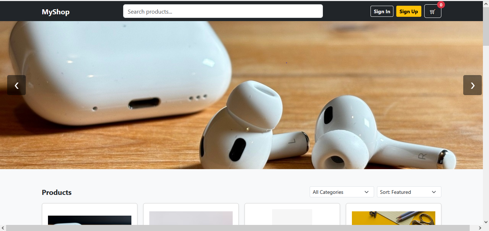
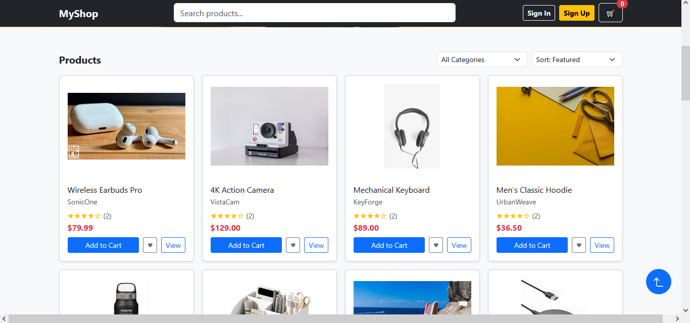
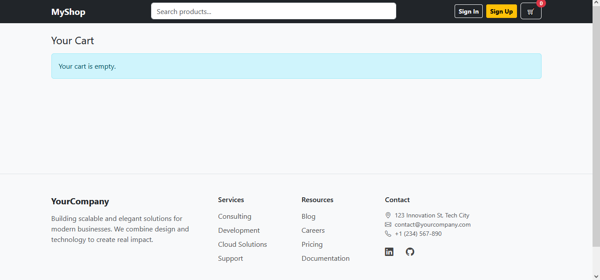
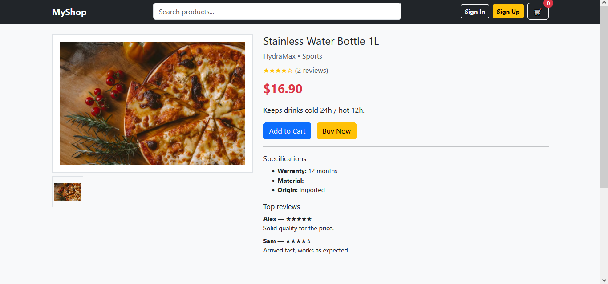

# 🛍️ E-Commerce Website

A simple and responsive e-commerce website built using **HTML, CSS,
JavaScript, and Bootstrap**.\
The project demonstrates a product listing, shopping cart functionality,
and a clean UI for practicing front-end development.

------------------------------------------------------------------------

## 🚀 Features

-   📱 **Responsive design** (Bootstrap grid system)\
-   🛒 **Product catalog** with images, names, prices, and categories\
-   ➕➖ **Add / Remove products** from the shopping cart\
-   🔄 **Update cart total dynamically** with JavaScript\
-   ❌ **Remove individual items** from the cart\
-   💳 **Checkout simulation** (basic alert / modal confirmation)

------------------------------------------------------------------------

## 🛠️ Technologies Used

-   **HTML5** -- structure\
-   **CSS3** -- styling\
-   **Bootstrap 5** -- responsive layout & components\
-   **JavaScript (ES6)** -- functionality & DOM manipulation

------------------------------------------------------------------------

## 📂 Project Structure

    ecommerce-website/
    │
    ├── index.html          # Home page with product listing
    ├── product.html        # Product details page
    ├── cart.html           # Shopping cart page
    ├── /assets
    │   ├── /css
    │   │   └── style.css      # Custom styles
    │   │   └── carousel.css   # carousel styles
    │   │   └── footer.css     # footer styles
    │   │   └── gotop.css      # gotop button styles
    │   ├── /js
    │   │   └── main.js        # Cart logic & interactions
    │   │   └── auth.js        # Authentication (signup, singin)
    │   │   └── carousel.js    # Carousel swiper
    │   │   └── gotop.js       # Gotop action
    │   └── /images         # Product & UI images
    └── README.md           # Project documentation

------------------------------------------------------------------------

## ⚡ Installation & Usage

1.  Clone the repository:

    ``` bash
    git clone https://github.com/your-username/ecommerce-website.git
    ```

2.  Open `index.html` in your browser.\

3.  Browse products, add items to the cart, and test the shopping
    experience.

------------------------------------------------------------------------

## 🎯 Future Improvements

-   🔑 User authentication (login/signup)\
-   🔍 Product search & filtering

------------------------------------------------------------------------

## 📸 Screenshots







------------------------------------------------------------------------

## 👨‍💻 Author

Developed with ❤️ by [Ahmed Ibrahim Zidan ](https://github.com/AhmedZidan399)
